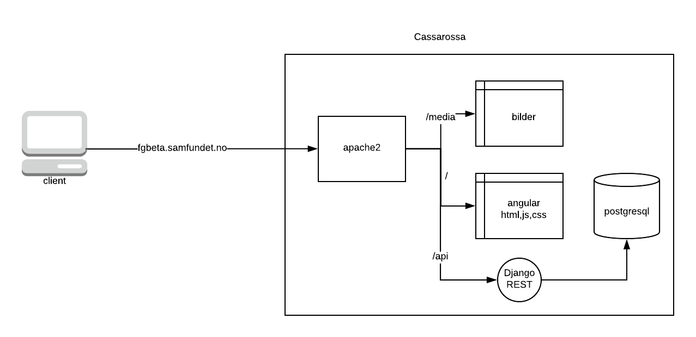

[](https://travis-ci.org/Samfundet/fg) Master

[](https://travis-ci.org/Samfundet/fg) Development

# Setup for Windows users

1. See steps 1, 2, 3 and 4 below
2. Run ´docker-compose up -d --build` (´-d´ is for detached mode, sometimes you want to see logs and can remove this)
3. To seed the dev database with fake data run:
    ```
    docker exec -u=postgres postgres sh /scripts/drop_and_recreate_database.sh
    docker exec django bash seed.sh
    ```
    As defined in droprecreatedb.sh
4. What's that? You would like to write frontend code and see live changes without reloading the docker container? Ok, fine. Go to `src/angular_frontend` and type `npm start` in your terminal. (you need [node](https://nodejs.org/en/) and run `npm i` once in the same folder)


# Setup for normies (REEEEEEE)

1. Get [docker](https://www.docker.com/products/overview).
2. Get [docker-compose](https://docs.docker.com/compose/install/).
3. Confirm that docker is installed (type 'docker -v' and 'docker-compose -v'), docker should be >=18 and docker-compose >=1.22
4. Clone the project, cd into the project directory.
5. Run ```bash development.sh```

If everything worked you should be able to see the angular application at [localhost and/or 127.0.0.1](http://127.0.0.1).

# Seeding
The database is seeded using migrations defined in
```./src/django_backend/fg/api/seed_migration.py```.
Simply bring the docker containers up and run ```droprecreatedb.sh```.

# New architecture (TODO)


