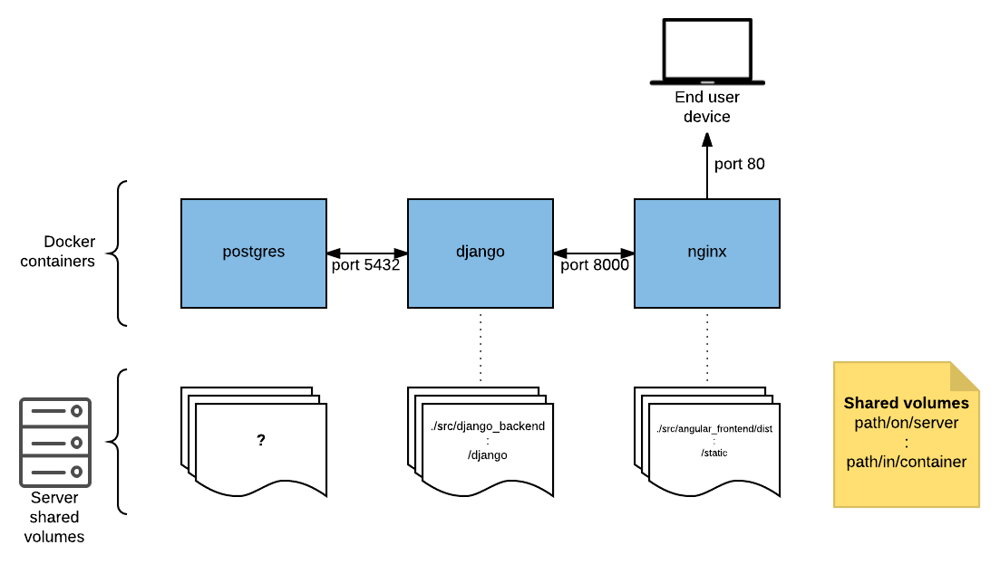

[](https://travis-ci.org/Samfundet/fg) Master 

[](https://travis-ci.org/Samfundet/fg) Development 

# Setup
     
1. Get [docker](https://www.docker.com/products/overview).
2. Get [docker-compose](https://docs.docker.com/compose/install/).
3. Confirm that docker is installed (type 'docker -v' and 'docker-compose -v'), docker should be >=1.13 and docker-compose >=1.6
4. Clone the project, cd into the project directory.
5. Build the docker containers:
```docker-compose build```
6. Bring the containers up:
```docker-compose up```
7. Finally in src/angular_frontend run ```npm install && ng build```

If everything worked you should be able to see the angular application at [127.0.0.1](http://127.0.0.1).
You could alternatively use ```bash development.sh``` after step 4.

# Production
```bash production.sh``` will bring up the containers with production environment. Use ```bash production.sh webhook``` on the
staging server if [webhook](https://github.com/adnanh/webhook) is installed.

# Hierarchy



# Backlog
Check the [trello board](https://trello.com/b/tbU3wIZc/fg-3-0)
